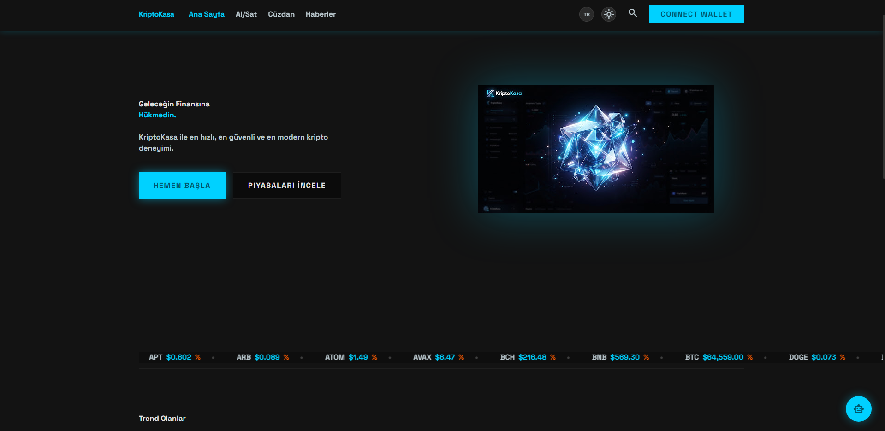
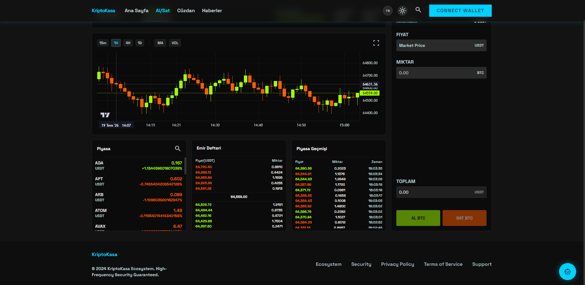
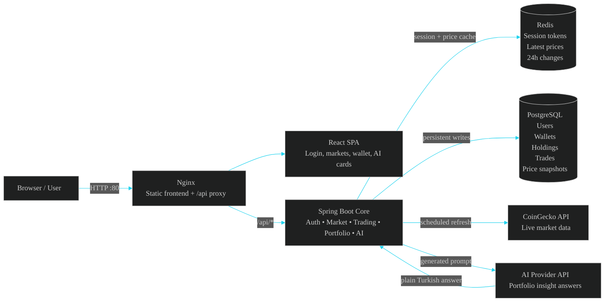
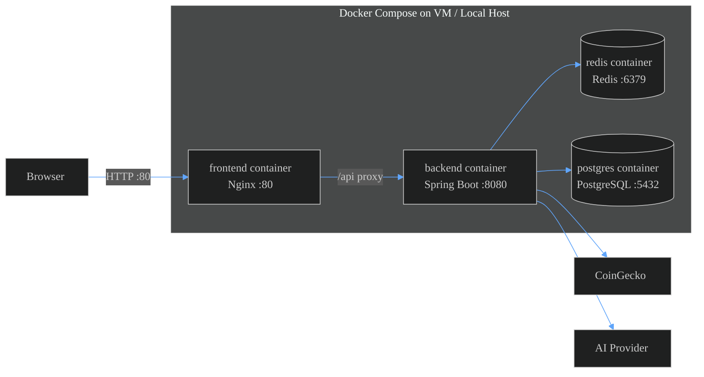
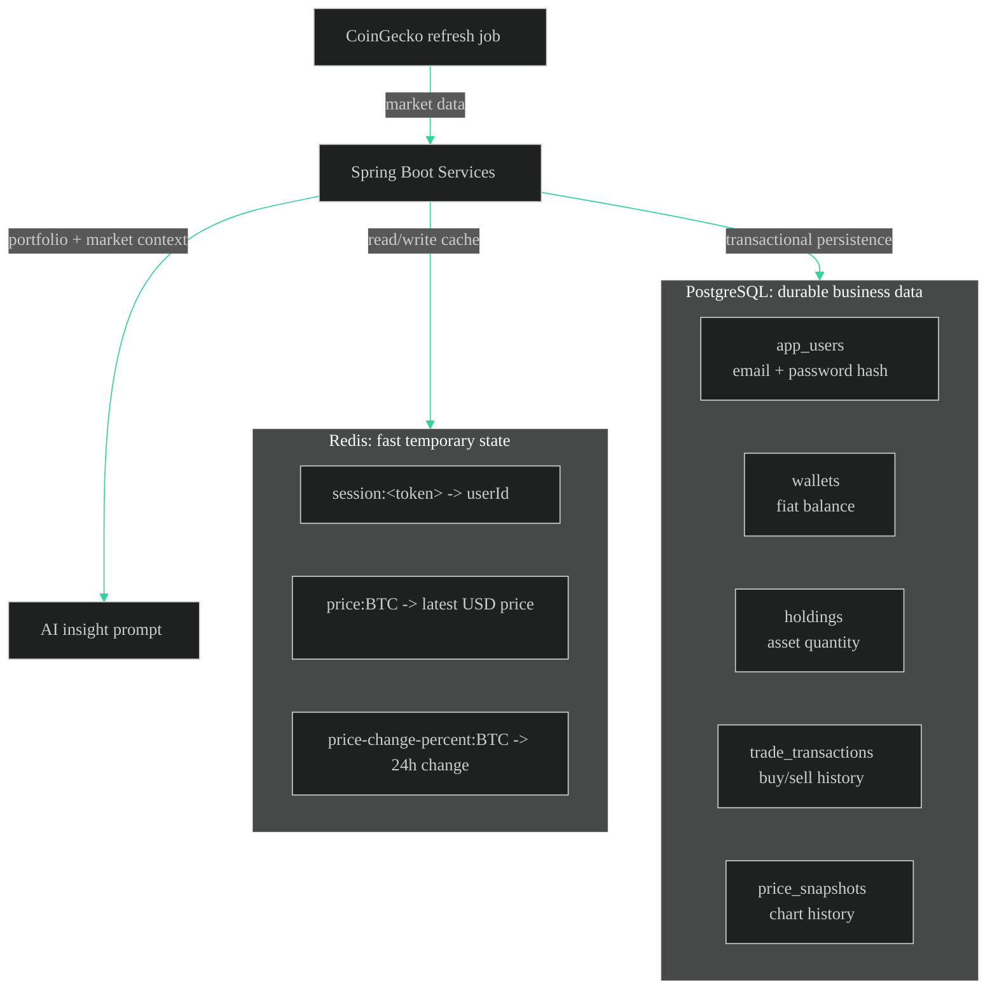
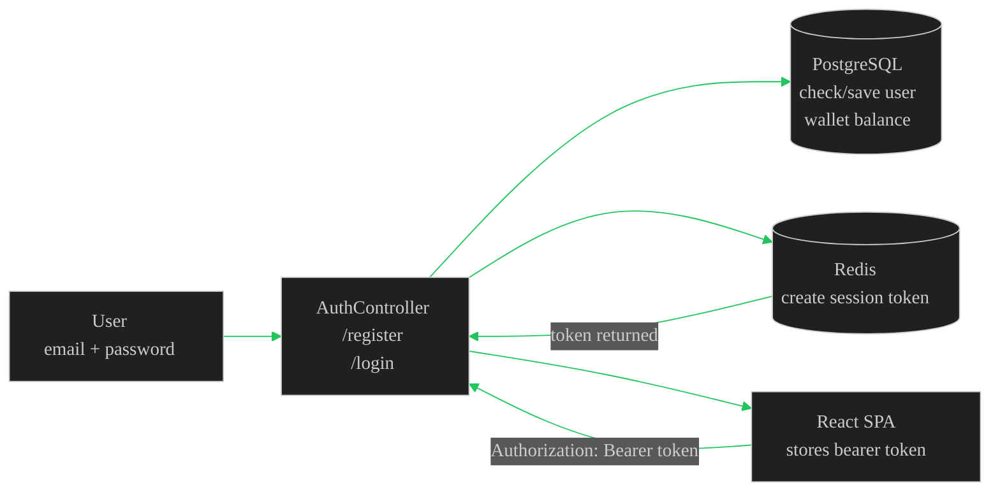
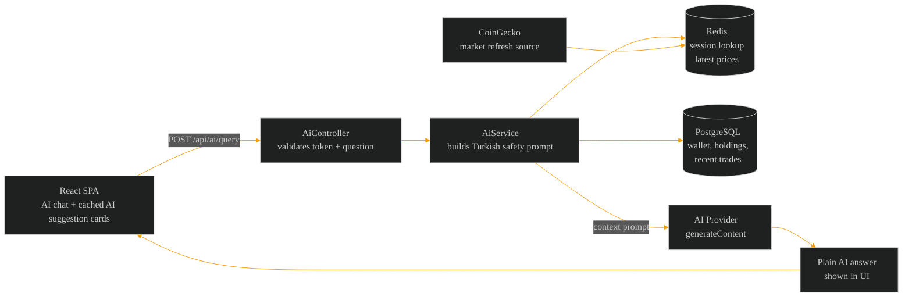

# CryptoVault

CryptoVault is a modern, full-stack cryptocurrency trading dashboard built with a Spring Boot backend, a premium React single-page frontend (SPA), PostgreSQL persistence, Redis caching, live market data integrations, AI insights, and Docker-based deployment.

Designed to emulate top-tier crypto exchanges, CryptoVault provides an ultra-fast, visually stunning, and responsive interface for tracking assets, executing simulated trades, and getting AI-powered market insights.

### Screenshots






## Core Features

- **Premium UI/UX:** A stunning, dark-mode native interface with micro-animations, glassmorphism, and responsive layout.
- **Live Crypto Market:** Real-time prices, 24h changes, and charts integrated with CoinGecko and Frankfurter APIs.
- **Trading Simulator:** Execute buy and sell orders at current market prices with instant transactional logic.
- **Portfolio Management:** Dedicated wallet section tracking fiat balances, crypto holdings, and recent order history.
- **AI Assistant:** A draggable AI chat widget that acts as your personal financial advisor with context of your portfolio.
- **Multi-language & Currency:** Built-in support for Turkish, English, German, French, and USD, TRY, EUR formats.
- **Secure Authentication:** BCrypt password hashing and Redis-backed session tokens.
- **News Feed:** Curated crypto news section displaying the latest market events.
- **Production Ready:** Fully dockerized with multi-stage builds, Nginx reverse proxy, and lightweight Alpine database containers.

## Project Structure

```text
KriptoKasa/
  Kasa/                    Spring Boot backend application
  frontend/                React + Vite frontend SPA
  docker-compose.yml       Local deployment with PostgreSQL & Redis (Alpine optimized)
  docker-compose.prod.yml  Production Docker Compose setup
  DEPLOY.md                Deployment documentation
```

## Tech Stack

| Layer | Technology |
| --- | --- |
| Frontend | React, Vite, Recharts, Context API, Vanilla CSS |
| Backend | Java 17, Spring Boot 3+ |
| Database | PostgreSQL (Alpine) |
| Cache | Redis (Alpine) |
| Migration | Flyway |
| Market Data | CoinGecko API |
| FX Rates | Frankfurter API |
| AI | External AI provider API |
| API Docs | springdoc OpenAPI / Swagger UI |
| Deployment | Docker, Docker Compose, Nginx |

## How The System Works

The browser never talks directly to PostgreSQL, Redis, or CoinGecko. It communicates exclusively via the backend REST API:

```text
React UI -> Nginx Proxy -> Spring Boot API -> Redis/PostgreSQL/CoinGecko/AI Provider
```

### Data Storage Strategy
- **Redis:** Stores fast, ephemeral data such as user session tokens, latest market prices, and 24h market change values.
- **PostgreSQL:** Stores permanent data like user accounts, balances, crypto holdings, trade transactions, and historical price snapshots.

## Dark Architecture Blueprints

The diagrams below show how the frontend, backend, Redis, PostgreSQL, CoinGecko, and the AI provider work together in production. Existing screenshots above are kept unchanged.

### System Architecture



### Docker Compose Deployment



### Redis And PostgreSQL Usage



### Register / Login Token Flow



### AI Insights Flow



### Trading Logic
Trading occurs transactionally:
- **Buy:** Checks fiat balance -> Deducts fiat -> Adds crypto holding -> Logs transaction.
- **Sell:** Checks crypto holding -> Deducts crypto -> Credits fiat -> Logs transaction.
If any step fails, the entire transaction rolls back automatically.

## Local Development

### Start Databases
Start PostgreSQL and Redis locally:
```bash
docker compose up -d postgres redis
```

### Run Backend
```bash
cd Kasa
./mvnw spring-boot:run
```

### Run Frontend
```bash
cd frontend
npm install
npm run dev
```
Open your browser to `http://localhost:5173`.

## Production Deployment

CryptoVault is optimized for minimal disk space and fast deployment using Docker Compose.

1. Configure your environment:
```bash
cp .env.example .env
nano .env
```

Ensure the following variables are set:
```text
POSTGRES_PASSWORD=your_strong_password_here
AI_PROVIDER_API_KEY=your_ai_provider_key_here
AI_PROVIDER_MODEL=your_ai_model_here
```

2. Build and start the containers:
```bash
docker compose up -d --build
```
This builds the backend using Maven wrapper, the frontend using Vite, and serves them via an Nginx alpine container.

3. Access the application:
- Application: `http://localhost`
- API Swagger Docs: `http://localhost/swagger-ui.html`

*For remote server deployment (e.g., AWS, GCP), see [DEPLOY.md](DEPLOY.md).*

## Useful Commands

- **Check API Health:** `curl http://localhost/api/market/prices`
- **View Backend Logs:** `docker compose logs -f backend`
- **Inspect Database Users:**
  ```bash
  docker exec -it cryptopal-postgres psql -U cryptopal -d cryptopal -c "SELECT id, email, display_name FROM app_users;"
  ```
